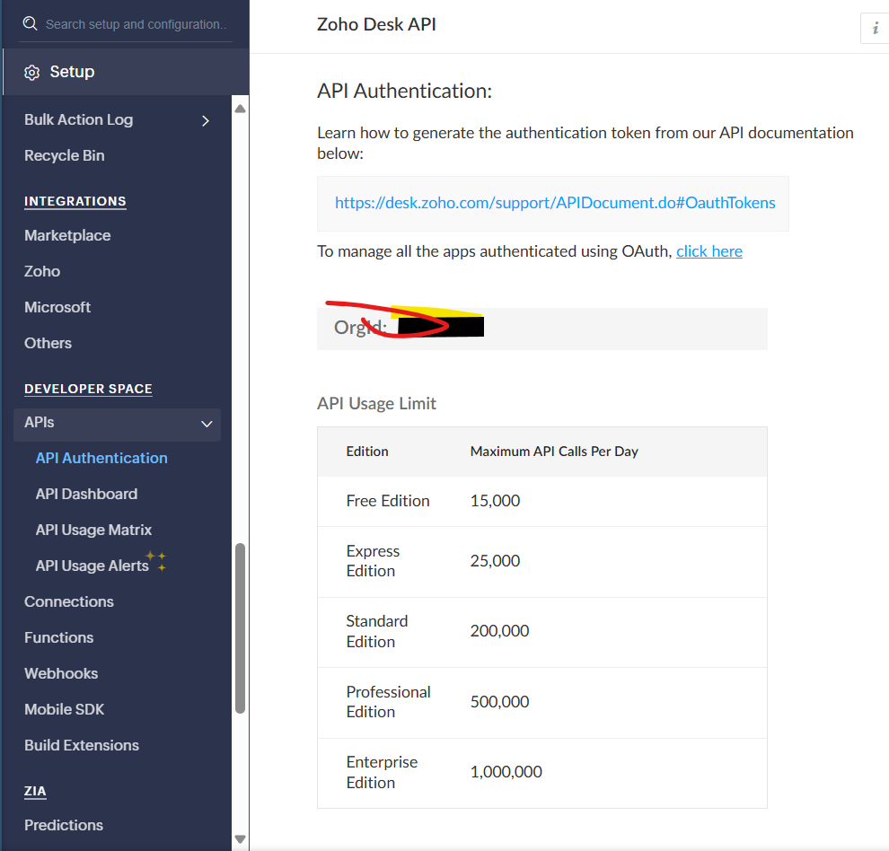

# Zoho Ticket Exports Chrome Extension

## 🚨 Important Configuration Note

**MANDATORY STEP:**

- Open `background.js`
- Replace `YOUR_ORGANIZATION_ID` with your actual Zoho organization ID
- Find your Zoho Organization ID:
  1. Log into Zoho Desk
  2. Check URL or account settings
  3. Copy the specific organization identifier

 ## NB: or Refresh zoho ticket page it automatically take your organization id

## Overview

Chrome extension to export tickets from Zoho Desk quickly and efficiently.

## Features

- One-click ticket export
- Supports multiple Zoho domains
- Keyboard shortcut (Alt+B)
- Direct ticket retrieval

## Installation

1. Clone repository
2. Open Chrome Extensions
3. Enable Developer Mode
4. Click "Load Unpacked"
5. Select extension folder

## Configuration

- Modify `manifest.json` for permissions
- Update `background.js` with organization ID

## Troubleshooting

- Verify Zoho login
- Check console for errors
- Confirm organization ID

# Issue
When downloading tickets, ensure that the ZohoDesk ticket page is open; otherwise, the CSV file will be empty
## Contributing

1. Fork repository
2. Create feature branch
3. Commit changes
4. Create Pull Request

## License

[Your License]

